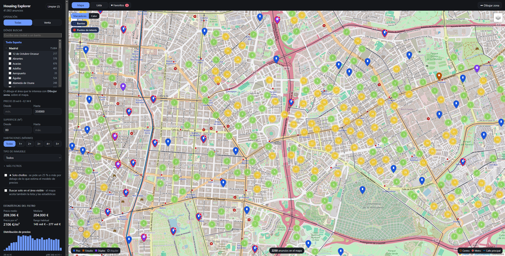
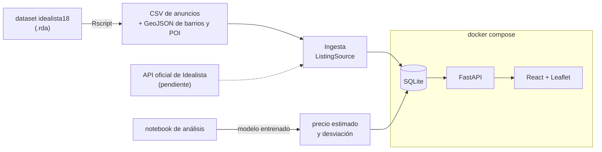
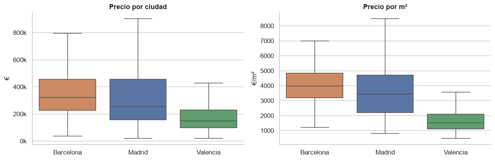
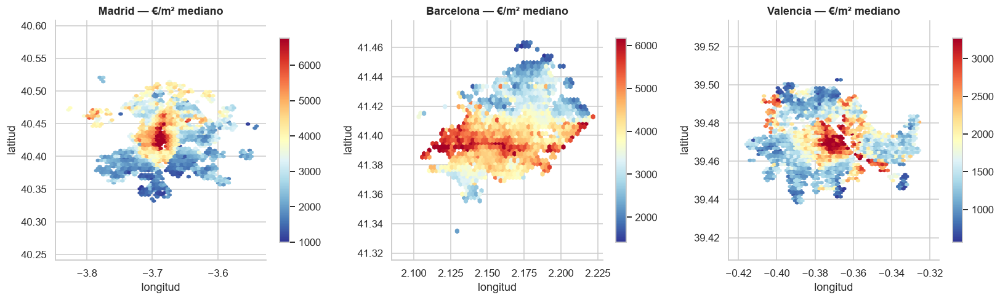
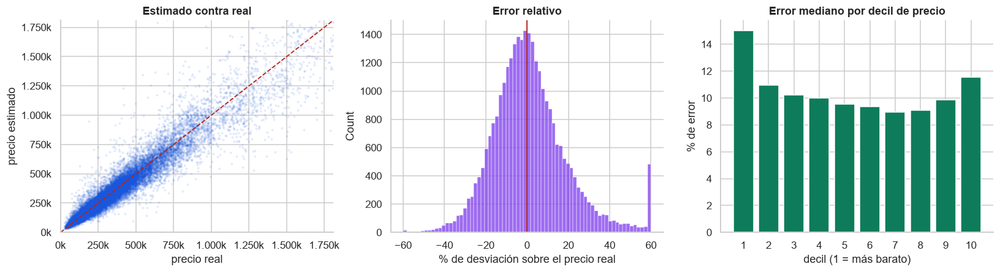
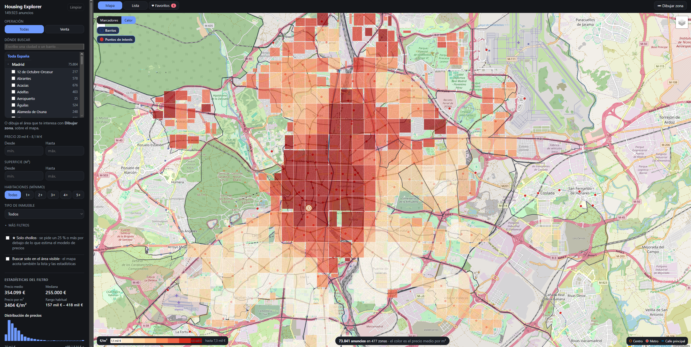

# Housing Explorer

Un visualizador de vivienda tipo Idealista, hecho de cero: ingesta de anuncios
reales, análisis de precios y un visor propio con mapa, filtros y detector de
chollos.

No es una copia de un portal inmobiliario. Es lo que se puede hacer cuando
tienes 149.923 anuncios reales y georreferenciados y los tratas como un
conjunto de datos: no «busca un piso», sino **dónde está caro, dónde está
barato y qué se sale de la norma**.



---

## De qué datos parte

De [**idealista18**](https://github.com/paezha/idealista18) (Rey-Blanco, Arbués,
López & Páez, 2024): anuncios reales de Idealista, publicados para
investigación bajo licencia ODbL.

| | |
| --- | --- |
| **Anuncios** | 149.923 de venta |
| **Ciudades** | Madrid (75.804) · Barcelona (46.728) · Valencia (27.391) |
| **Año** | 2018, en cuatro trimestres |
| **Por anuncio** | Precio, superficie, habitaciones, baños, planta, año, estado, ascensor, garaje, piscina… 35 variables, **con coordenadas** |
| **Además** | 277 polígonos de barrio, y el centro, las bocas de metro y la calle principal de cada ciudad |

El proyecto está preparado para dejar de depender de un dataset estático: la
ingesta va detrás de una interfaz `ListingSource`, y añadir la **API oficial de
Idealista** cuando lleguen las credenciales toca un solo fichero. El esqueleto
de esa fuente ya está en el repo, y el resto del sistema no sabe de dónde viene
un anuncio.

---

## Arquitectura

Tres piezas y un contrato. Un **backend FastAPI** normaliza los anuncios de
cualquier fuente a un mismo esquema, los guarda en **SQLite** y los sirve por
HTTP con todo el filtrado empujado a SQL; un **frontend React + Leaflet** los
pinta. Todo se levanta con Docker.



El detalle está en la [documentación técnica](README_TECHNICAL.md).

---

## Cómo se levanta

Un solo comando. No hace falta tener Python, ni Node, ni R.

```bash
docker compose up --build
```

Y la web queda en **<http://localhost:5173>** (la API, en
<http://localhost:8000/docs>).

La primera vez tarda unos minutos: construye las imágenes y siembra la base de
datos. Después, `docker compose up -d` levanta todo en segundos. Para pararlo,
Ctrl+C o `docker compose down`.

> El `--build` no sobra: el código viaja **dentro** de la imagen, no montado
> desde el host, así que sin él seguirías ejecutando la versión con la que se
> construyó.

Para arrancarlo a mano, sin Docker, está el
[README técnico](README_TECHNICAL.md#a-mano).

---

## El análisis

[`notebooks/analisis.ipynb`](notebooks/analisis.ipynb) — se lee en GitHub sin
ejecutar nada: va versionado con sus salidas y sus gráficos.

**Análisis exploratorio** de los 149.923 anuncios: distribución de precios,
€/m², relación con superficie, habitaciones y planta, y la geografía del precio
en las tres ciudades.



Barcelona es la más cara en las dos escalas con la misma superficie mediana que
Madrid; Valencia tiene las viviendas más grandes y el metro más barato. Y el
precio tiene cola larga —media 354.100 €, mediana 255.000 €—, razón por la que
el modelo trabaja sobre `log(precio)`.



Puesto sobre el mapa, el resultado más claro del análisis: **la ubicación manda
sobre todo lo demás**. Entre las zonas hay 6× de diferencia en €/m², y la
relación superficie–precio deja de ser monótona al mezclar las tres ciudades y
se recompone dentro de cada una. La superficie solo dice lo que vale una
vivienda si ya se sabe dónde está.

---

## El modelo de precio

Un `HistGradientBoostingRegressor` que estima lo que **debería** costar una
vivienda a partir de sus características y su ubicación.

| | MAE | MAPE | R² (log) |
| --- | ---: | ---: | ---: |
| Mediana (línea base) | 196.836 € | 64,5 % | 0,00 |
| Ridge sin zona | 112.717 € | 26,0 % | 0,81 |
| **Gradient boosting** | **47.943 €** | **14,1 %** | **0,935** |

El error mediano es del 10,3 % y el 78 % de las estimaciones cae dentro de un
±20 % del precio real. Validación cruzada de 5 particiones: R²(log) = 0,932 ±
0,001.



**Dónde está y cuánto mide** explican el 89 % de la importancia: barrio (0,61 de
caída de R² al permutarlo) y superficie construida (0,47), contra 0,02 de la
siguiente variable.

### Y cómo se reutiliza: el detector de chollos

El notebook exporta el modelo entrenado a `backend/models/`, y un script del
backend lo pasa por los 149.923 anuncios. Cada uno guarda lo que el modelo
estima que debería costar y **cuánto se aparta el precio que se pide**.

Un anuncio es «posible chollo» cuando se pide un **25 % o más** por debajo de la
estimación. El umbral no es redondo por gusto: el error mediano del modelo es
del 10,3 %, así que −25 % es unas 2,4 veces su propio error — lo bastante lejos
como para no ser ruido del modelo. Salen **6.227 chollos, el 4,2 %**.

En el visor se ven con un anillo rojo en el mapa y una insignia en la tarjeta, y
hay un interruptor **★ Solo chollos** que deja solo esos, ordenados por cuánto
se apartan.

---

## El visor

### Mapa

- **Sin tope de anuncios.** El servidor decide la resolución según cuántos
  coincidan: pocos llegan como marcadores individuales, muchos llegan agrupados
  en celdas calculadas en SQL. El total es siempre exacto, así que el mapa nunca
  tiene que decir «1.000 de 149.923».
- **Icono por tipo de vivienda** —piso, casa, estudio, dúplex, ático…—, hueco si
  es alquiler y con anillo rojo si es chollo.
- **Cuatro capas base**: mapa, satélite, terreno y claro.
- **Dibujar el área de búsqueda a mano**, que se resuelve dentro de SQL para que
  el recuento no se separe de los resultados.

### Mapa de calor por €/m²



Conmutable con el mapa de marcadores desde el propio mapa, y respeta los mismos
filtros. Cada celda es el **precio medio por m²** de lo que contiene, con los
tramos cortados por cuantiles.

No es un difuminado tipo `Leaflet.heat` a propósito: una capa de calor pinta
*densidad*, así que un barrio con muchos pisos baratos brillaría más que uno con
pocos caros — respondería a «dónde hay muchos anuncios» disfrazado de «dónde es
caro». Aquí cada celda es un número y su color significa ese número.

### Barrios y puntos de interés

Dos capas de contexto que se encienden por separado, sacadas de la geografía que
el dataset ya traía:

- Los **277 barrios**, con su nombre al pasar el ratón. **Un clic busca dentro
  de ese barrio**, y las estadísticas de la izquierda pasan a describirlo.
- El **centro de la ciudad**, las **bocas de metro** y la **calle principal**
  como línea.

Cada anuncio sabe en qué barrio cae, resuelto por geometría en la ingesta
(99,8 % localizados), y eso es lo que hace que filtrar por barrio sea inmediato.

### Filtros

Operación, precio, superficie, habitaciones y tipo de inmueble; y plegados,
baños, planta, año, estado de conservación, extras (ascensor, garaje, piscina,
portero…) y distancia máxima al centro o al metro.

**Dónde buscar** es un árbol de ciudad → barrios por orden alfabético, con
buscador de texto que ignora acentos —`malasana` encuentra «Malasaña»— y
selección múltiple.

### Estadísticas, lista y favoritos

El panel izquierdo sigue a los filtros activos: precio medio, mediana, €/m²,
rango habitual, histograma, tabla por barrio, €/m² por habitaciones y por
superficie, curva de precio por distancia al centro e impacto de cada extra.

La **lista** pagina en servidor y ordena por fecha, precio o desviación. Y los
**favoritos** se guardan en el navegador con `localStorage`: sin cuenta y sin
backend, con la contrapartida —que la interfaz dice en vez de callar— de que no
viajan a otro dispositivo.

---

## Más

- **[Documentación técnica](README_TECHNICAL.md)** — arquitectura, estructura del
  repo, instalación manual, endpoints de la API, configuración y las decisiones
  de diseño con sus medidas.
- **[PROGRESS.md](PROGRESS.md)** — el estado del proyecto fase a fase.
- **[data/README.md](data/README.md)** — de dónde salen los datos y cómo se
  reproduce la ingesta.

Datos bajo licencia **ODbL v1.0**. Mapas © OpenStreetMap contributors.
